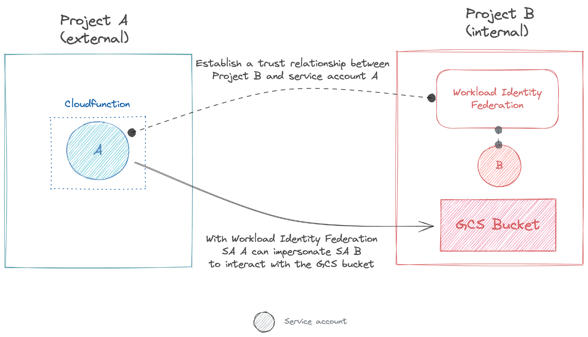

# LAB: create a workload identity federation with another GCP project

This LAB is related to this [blog post]() and explained how to setup a identity federation with a service account hosted in another project.

We will create something like this:



*Note: for simplicity's sake, we will create all resources in the same project*

## Prerequisite

Have `gcloud` installed on your machine.

## Setup

```bash
PROJECT=YOUR_PROJECT

gcloud config set project $PROJECT

# Enable require services
gcloud services enable iam.googleapis.com
gcloud services enable iamcredentials.googleapis.com
gcloud services enable cloudresourcemanager.googleapis.com
gcloud services enable cloudbuild.googleapis.com
gcloud services enable cloudfunctions.googleapis.com
gcloud services enable storage.googleapis.com
```


### Enable Cloud Storage audit logs

```bash
# Get current project's IAM policies
gcloud projects get-iam-policy $PROJECT > /tmp/policy.yaml
```

Append the following lines to `/tmp/policy.yaml`:

```yaml
auditConfigs:
- auditLogConfigs:
  - logType: DATA_READ
  service: storage.googleapis.com
```

```bash
# Save changes
gcloud projects set-iam-policy $PROJECT /tmp/policy.yaml
```

```bash
# Create the two testing service accounts
gcloud iam service-accounts create external-sa
gcloud iam service-accounts create internal-sa

# Global vars
IDENTITY_POOL_ID=external-gcp-sa-pool
PROVIDER_ID=google-oidc
TRUSTED_SA_EMAIL="external-sa@${PROJECT}.iam.gserviceaccount.com"
TRUSTED_SA_ID="$(gcloud iam service-accounts describe ${TRUSTED_SA_EMAIL} --format='value(uniqueId)')"
INTERNAL_SA_EMAIL="internal-sa@${PROJECT}.iam.gserviceaccount.com"
PROJECT_NUMBER="$(gcloud projects describe $(gcloud config get project) --format='value(projectNumber)')"
LOCATION=global
AUDIENCE="projects/$PROJECT_NUMBER/locations/$LOCATION/workloadIdentityPools/$IDENTITY_POOL_ID/providers/$PROVIDER_ID"
BUCKET_NAME="demo-bucket-$(openssl rand -hex 6)"
BUCKET_LOCATION=eu
CF_REGION=europe-west1
CF_URL="https://$CF_REGION-$PROJECT.cloudfunctions.net/gcp-to-gcp-federation"
DEMO_APP_DIR="$(PWD)/demo_app"

# Create CF application
mkdir $DEMO_APP_DIR
curl -sS https://raw.githubusercontent.com/LoicSikidi/workload-identity-federation-with-gcp-project/master/main.py -o $DEMO_APP_DIR/main.py
curl -sS https://raw.githubusercontent.com/LoicSikidi/workload-identity-federation-with-gcp-project/master/requirements.txt -o  $DEMO_APP_DIR/requirements.txt

# Setup a workload identity pool and provider
gcloud iam workload-identity-pools create $IDENTITY_POOL_ID --location $LOCATION --display-name "Federation with external GCP SAs"
gcloud iam workload-identity-pools providers create-oidc $PROVIDER_ID \
--location $LOCATION \
--workload-identity-pool $IDENTITY_POOL_ID \
--attribute-mapping='google.subject="ext_gcp_sa::" + assertion.sub + "::" + assertion.email,attribute.sa_id=assertion.sub,attribute.sa_email=assertion.email' \
--attribute-condition="attribute.sa_id in [\"${TRUSTED_SA_ID}\"]" \
--issuer-uri="https://accounts.google.com"

# Create External Account Credentials file
gcloud iam workload-identity-pools create-cred-config $AUDIENCE \
--service-account=$INTERNAL_SA_EMAIL \
--credential-source-url="http://metadata.google.internal/computeMetadata/v1/instance/service-accounts/default/identity?audience=//iam.googleapis.com/${AUDIENCE}" \
--credential-source-headers=Metadata-Flavor=Google \
--output-file="$DEMO_APP_DIR/credentials.json"

# Create testing bucket (which content will be red by the CloudFunction)
touch hello-world.txt
gcloud storage buckets create gs://$BUCKET_NAME --location=$BUCKET_LOCATION -b
gcloud storage cp hello-world.txt gs://$BUCKET_NAME

# Create IAM permissions
# 1. Give the right to the external account to impersonate internal account
gcloud iam service-accounts add-iam-policy-binding $INTERNAL_SA_EMAIL \
--member="principalSet://iam.googleapis.com/projects/$PROJECT_NUMBER/locations/$LOCATION/workloadIdentityPools/$IDENTITY_POOL_ID/attribute.sa_id/$TRUSTED_SA_ID" \
--role="roles/iam.workloadIdentityUser"

# 2. Give internal account right to read bucket's objects
gsutil iam ch serviceAccount:$INTERNAL_SA_EMAIL:objectViewer gs://$BUCKET_NAME

# Deploy CF
gcloud functions deploy gcp-to-gcp-federation \
--region=$CF_REGION \
--runtime=python310 \
--source=$DEMO_APP_DIR \
--entry-point=main \
--trigger-http \
--set-env-vars="GOOGLE_APPLICATION_CREDENTIALS=credentials.json,BUCKET_NAME=$BUCKET_NAME,GOOGLE_CLOUD_PROJECT=$PROJECT" \
--service-account=$TRUSTED_SA_EMAIL
```

## Testing

```bash
# Call the cloudfunction to produce audit logs
for i in {1..10}
do
    curl -sS -H "Authorization: Bearer $(gcloud auth print-identity-token)" $CF_URL
done
```

Check Cloud Logging with this query `protoPayload.serviceName="storage.googleapis.com"` to see audit logs and check IAM delegation details.

## Clean Up

```bash
gcloud functions delete gcp-to-gcp-federation --region=$CF_REGION -q
gcloud iam service-accounts delete $INTERNAL_SA_EMAIL -q
gcloud iam service-accounts delete $TRUSTED_SA_EMAIL -q
gcloud iam workload-identity-pools delete $IDENTITY_POOL_ID --location $LOCATION -q
gcloud storage rm -r gs://$BUCKET_NAME -q
rm -rf $DEMO_APP_DIR/
```

***Note:** disable also Cloud Storage audit logs*